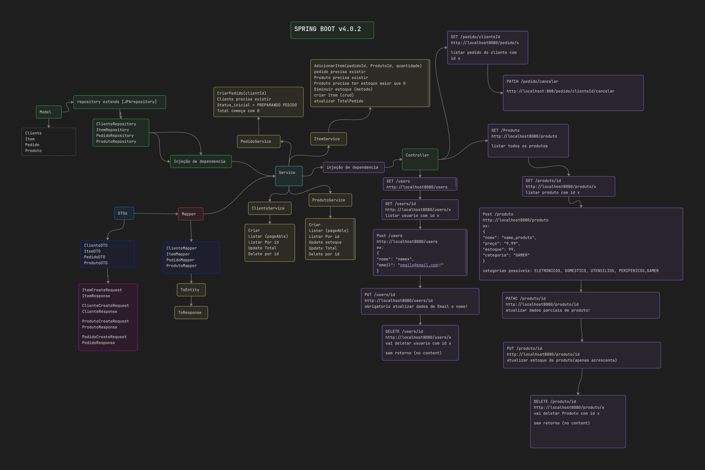
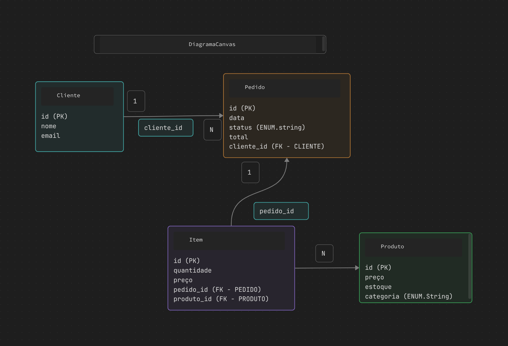

# Ordering System API (API de Pedidos)

Esta é uma API REST desenvolvida com **Java** e **Spring Boot** para gerenciamento de um sistema de pedidos. O projeto foca em relacionamentos complexos de banco de dados e separação de responsabilidades.

## Arquitetura (canvas)


## Modelagem de Dados


## Tecnologias Utilizadas

* **Java 17** 
* **Spring Boot 4.0.2**
* **Spring Data JPA**: Para persistência de dados.
* **MySQL**: Banco de dados relacional.
* **Jakarta Validation**: Para validação de dados.
* **Maven**: Gerenciador de dependências.

## Arquitetura 

O projeto segue os principios da arquitetura em camadas.

* **Controller**: Exposição dos endpoints REST e validação de entrada.
* **Service**: Onde reside toda a lógica de negócio (cálculos e validaçoes de dados).
* **Repository Layer**: Interface de comunicação com o MySQL.
* **DTO**: Uso de *Data Transfer Objects* para evitar a exposição direta das entidades e proteger a api.
* **Mapper**: Componentes dedicados para conversão entre Entidades e DTOs, mantendo o código do Service mais limpo e focado na lógica.

## Desafios Técnicos Resolvidos

### 1. Relacionamentos Complexos (4 Entidades)
essa API gerencia um relacionamento de quatro entidades principais: `Cliente`, `Pedido`, `Item` e `Produto`. O desafio foi implementar a entidade associativa `Item`, que atua como a ligação entre o pedido e o produto, permitindo multiplos produtos por pedido.

### 2. Snapshot de Preço e Integridade
Uma regra de negócio crítica implementada foi o **Preço Histórico**. No momento da criação do pedido, a API busca o preço atual do produto no banco de dados e grava no `Item`. Isso garante que, se o preço do produto mudar, o valor total do pedido realizado anteriormente permaneça íntegro.


## Endpoints Principais

| Método | Endpoint | Descrição |
| :--- | :--- | :--- |
| `POST` | `/pedidos` | Cria um novo pedido com múltiplos itens. |
| `GET` | `/pedidos` | Lista todos os pedidos realizados. |
| `POST` | `/cliente` | Cadastra um novo cliente. |
| `POST` | `/produtos` | Cadastra um novo produto. |

### Exemplo de JSON para criação de Cliente:
```json
{
  "nome": "namexx",
  "email": "namexx@gmail.com"
}
```

### Exemplo de JSON para criação de Produto:
```json
{
	"nome": "name_produto",
	"preço": "9,99",
	"estoque": 99,
	"categoria": "GAMER"
}

categorias possiveis: ELETRONICOS,  DOMESTICO,  UTENSILIOS, PERIFERICOS,GAMER
```
`categoria escrita em maiusculo :)`

<br>

### Exemplo de JSON para criação de Pedido:
```json
{
  "clienteId": 1,
  "status": "PREPARANDO_PEDIDO",
  "items": [
    {
      "produtoId": 2,
      "quantidade": 3
    },
    {
      "produtoId": 1,
      "quantidade": 8
    }
  ]
}

```

# como executar
- 1. clone o repositorio
`git clone git@github.com:Gabriel9371/Api-Pedidos.git`

- 2. crie um banco de dados chamado `api_product`

- 3. configure o applicantio.properties com as credenciais do seu MySQL local.

- 4. execute o projeto pelo maven ou sua IDE

```
mvn spring-boot:run

```
## Desenvolvido por Gabriel
